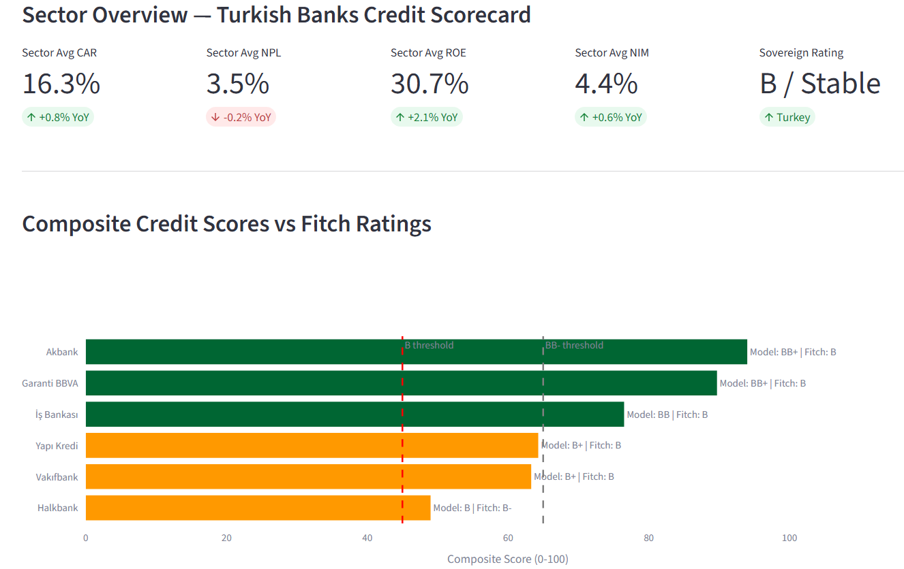

# Turkish Banks Credit Risk \& Rating Analysis Platform

### An Analyst Simulation

[!\[Python](https://img.shields.io/badge/Python-3.10+-blue.svg)](https://python.org)
[!\[License: MIT](https://img.shields.io/badge/License-MIT-yellow.svg)](LICENSE)

> A quantitative credit analysis framework simulating the methodology of a sovereign-linked bank rating analyst.  
> Built to replicate the analytical workflow of a Fitch/Moody's/S\\\&P credit analyst covering Turkish financial institutions.

\---

## Project Overview

This project simulates how a credit rating analyst would monitor and assess the creditworthiness of major Turkish banks, integrating:

* **Financial ratio analysis** (capital adequacy, asset quality, profitability, liquidity)
* **Sovereign risk linkage** (macro variables: USDTRY, CDS spreads, inflation, CBRT policy rate)
* **Explainable ML risk scoring** (XGBoost + SHAP)
* **NLP sentiment layer** (earnings call transcripts, annual report tone analysis)
* **Rating Committee simulation** (Analyst Memos in Fitch-style format)

\---

## Banks Covered

|Bank|Ticker|Ownership|
|-|-|-|
|Garanti BBVA|GARAN|Private|
|Akbank|AKBNK|Private|
|İş Bankası|ISCTR|Private|
|Yapı Kredi|YKBNK|Private|
|Halkbank|HALKB|State|
|Vakıfbank|VAKBN|State|

\---

## Project Structure

```
turkish-banks-credit-rating/
│
├── data/
│   ├── raw/                    # Raw financial data from public sources
│   └── processed/              # Cleaned, normalized datasets
│
├── notebooks/
│   ├── 01\\\_financial\\\_analysis.ipynb     # Phase 1: Core financial metrics
│   ├── 02\\\_sovereign\\\_linkage.ipynb      # Phase 2: Macro risk integration
│   ├── 03\\\_risk\\\_scoring.ipynb           # Phase 2: XGBoost + SHAP scoring
│   └── 04\\\_nlp\\\_sentiment.ipynb         # Phase 3: NLP layer (optional)
│
├── src/
│   ├── data\\\_loader.py          # Data ingestion from APIs
│   ├── financial\\\_metrics.py    # Ratio calculations
│   ├── risk\\\_scorer.py          # ML risk scoring engine
│   ├── sovereign\\\_linkage.py    # Macro variable integration
│   └── report\\\_generator.py    # Analyst memo generation
│
├── reports/
│   └── analyst\\\_memos/          # Rating Committee simulation outputs
│       ├── GARAN\\\_memo.md
│       ├── AKBNK\\\_memo.md
│       └── ...
│
├── streamlit\\\_app/
│   └── app.py                  # Interactive dashboard
│
├── requirements.txt
├── README.md
└── LICENSE
```

\---

## Data Sources

|Source|Data|Access|
|-|-|-|
|[BDDK](https://www.bddk.org.tr/BultenV2/)|Bank financials (quarterly)|Free / Public|
|[TCMB (EVDS)](https://evds2.tcmb.gov.tr/)|Macro data, FX, rates|Free API|
|[yfinance](https://pypi.org/project/yfinance/)|Stock prices, market data|Free Python library|
|[World Bank API](https://data.worldbank.org/)|GDP, inflation, sovereign indicators|Free API|
|[Investing.com](https://www.investing.com/)|Turkey CDS spreads|Manual / scraping|
|[KAP (Public Disclosure)](https://www.kap.org.tr/)|Annual reports, earnings releases|Free / Public|

\---

## Methodology

### Phase 1 — Financial Analysis Engine

Core CAMELS-inspired metrics:

* **Capital:** CET1, CAR, Leverage ratio
* **Asset Quality:** NPL ratio, Cost of Risk, Coverage ratio
* **Management/Profitability:** ROE, ROA, NIM, Cost-to-Income
* **Liquidity:** LCR, Loan-to-Deposit ratio, FX funding gap
* **Sensitivity:** FX loan exposure, interest rate gap

### Phase 2 — Sovereign Risk Linkage

* USDTRY volatility impact on FX-denominated assets
* CDS spread correlation with bank risk scores
* CBRT policy rate sensitivity analysis
* Inflation pass-through to NIM and asset quality

### Phase 3 — Explainable Risk Scoring

* XGBoost classifier trained on historical financial ratios
* SHAP values for factor-level explainability
* Output: Bank Risk Score (0–100) with top 5 risk drivers

### Phase 4 — Rating Committee Simulation

* Analyst Memo for each bank (Fitch-style format)
* Sections: Strengths / Weaknesses / Key Risks / Sovereign Linkage / Outlook / Rating Action

\---

## Analyst Credentials

This project was developed by **Ali Kızıltoprak**, holder of:

* SPK (CMB Turkey) **Düzey 3** License
* SPK **Corporate Governance \& Credit Rating** License
* 16+ years of finance, risk management, and capital markets experience
* Master of Data Science, University of Pittsburgh

\---

## Dashboard Preview




!\[Composite Scores](reports/composite_scores.png)


!\[Radar Chart](reports/radar_chart.png)

\---

## Disclaimer

> This project is an \\\*\\\*educational analyst simulation\\\*\\\* created for portfolio and learning purposes.  
> It does not represent investment advice, an official credit rating, or the views of any rating agency.  
> All data used is publicly available. Model-implied ratings are illustrative and not actionable.  
> This work is not affiliated with Fitch Ratings, Moody's, S\\\&P, or any other rating agency.

\---

## License

MIT License — see [LICENSE](LICENSE)

